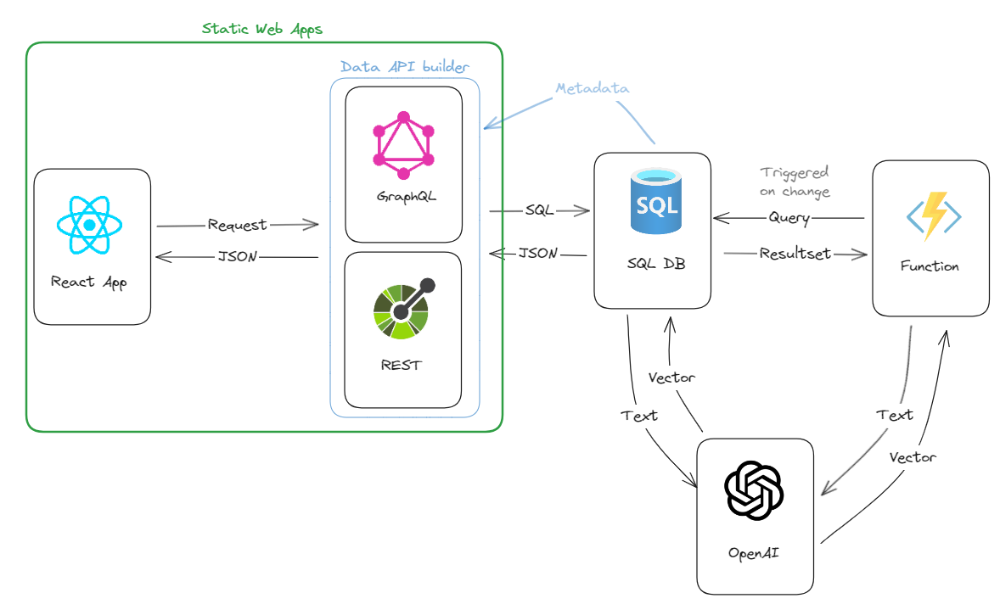

# Session Recommender Sample



A session recommender built using

- Azure Static Web Apps
- Azure OpenAI
- Azure Functions
- Azure SQL Database
- Data API builder

## Getting Started

Create a new repository using this repository as a template. Clone the respository locally and then a new `.env` file using the `.env.example` file as a template.

Create an [embedding model](https://learn.microsoft.com/en-us/azure/ai-services/openai/concepts/models#embeddings-models) using the [Azure OpenAI](https://learn.microsoft.com/en-us/azure/ai-services/openai/how-to/create-resource?pivots=web-portal) and name it `embeddings`. Make sure to use the `text-embedding-ada-002` mode. Once the resource is created, and add the API key and the API url into the `.env` file.

Create an new [Azure SQL database](https://learn.microsoft.com/en-us/azure/azure-sql/database/single-database-create-quickstart?view=azuresql&tabs=azure-portal), then run the `./database/setup-database.sql` script to set up the database.

Create a new azuredeploy.parameter.json file using the azuredeploy.parameter.json.example file as a template. Then run the following command to deploy the database to Azure.

```bash
az group create -g <your-resource-group-name> -l <location>
az deployment group create --resource-group <your-resource-group-name> --template-file main.bicep --parameters azuredeploy.parameters.json
```

[Deploy the Static Web App](https://learn.microsoft.com/en-us/azure/static-web-apps/static-web-apps-cli-deploy) and then link the Static Web App to the created database using the [Database Connections](https://learn.microsoft.com/en-us/azure/static-web-apps/database-overview) feature.

Create an Azure Function and then deploy the function available in the `func` folder. If you are using VS Code, you can use the Azure Function extension to deploy the function. Right click on the `/func` folder, select "Deploy to Function App" and then select the function app that has was created in the previous step created.

Azure function must be deployed as a stand-alone resource and cannot be deployed as part of the Static Web App, as a managed function within the Static Web App only supports HTTP triggers.
