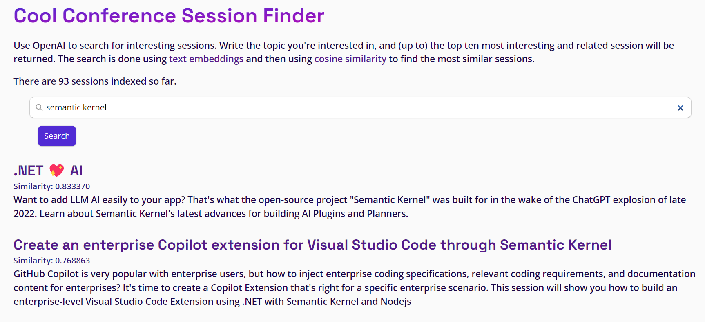

# Session Recommender Sample


A session recommender built using

- [Azure Static Web Apps](https://learn.microsoft.com/en-us/azure/static-web-apps/overview)
- [Azure OpenAI](https://learn.microsoft.com/en-us/azure/ai-services/openai/)
- [Azure Functions](https://learn.microsoft.com/en-us/azure/azure-functions/functions-overview?pivots=programming-language-csharp)
- [Azure SQL Database](https://www.sqlservercentral.com/articles/the-sql-developer-experience-beyond-rdbms)
- [Data API builder](https://aka.ms/dab)

For more details on the solution check also the following articles:

- [How I built a session recommender in 1 hour using Open AI](https://dev.to/azure/how-i-built-a-session-recommender-in-1-hour-using-open-ai-5419)
- [Vector Similarity Search with Azure SQL database and OpenAI](https://devblogs.microsoft.com/azure-sql/vector-similarity-search-with-azure-sql-database-and-openai/)

# Deploy the sample using the Azure Developer CLI (azd) template

The Azure Developer CLI (`azd`) is a developer-centric command-line interface (CLI) tool for creating Azure applications.

## Install AZD CLI

You need to install it before running and deploying with the Azure Developer CLI.

### Windows

```powershell
powershell -ex AllSigned -c "Invoke-RestMethod 'https://aka.ms/install-azd.ps1' | Invoke-Expression"
```

### Linux/MacOS

```
curl -fsSL https://aka.ms/install-azd.sh | bash
```

After logging in with the following command, you will be able to use azd cli to quickly provision and deploy the application.

## Authenticate with Azure

Make sure AZD CLI can access Azure resources. You can use the following command to log in to Azure:

```
azd auth login
```

## Initialize local environment

Execute the `azd init` command to initialize the environment.

**Note**: Resource Group Scoped Deployment is currently an alpha feature, so please run the following command before running command `azd up`.

```
azd config set alpha.resourceGroupDeployments on
```

Then download the template to the current directory:

```
azd init -t Azure-Samples/azure-sql-db-session-recommender
```

According to the prompt, enter an environment name.

## Deploy the sample

Run `azd up` to provision all the resources to Azure and deploy the code to those resources.

```
azd up 
```

According to the prompt, select `subscription` and `location`, these are the necessary parameters when you create resources. After that, choose a resource group or create a new resource group. Wait a moment for the resource deployment to complete, click the Website endpoint and you will see the web app page.

**Note**: Make sure to pick a region where all services are available like, for example, *West Europe* or *East US 2*

## Test the solution

Add a new row to the `Sessions` table using the following SQL statement:

```sql
insert into web.sessions 
    (title, abstract)
values
    ('Building a session recommender using OpenAI and Azure SQL', 'In this fun and demo-driven session you’ll learn how to integrate Azure SQL with OpenAI to generate text embeddings, store them in the database, index them and calculate cosine distance to build a session recommender. And once that is done, you’ll publish it as a REST and GraphQL API to be consumed by a modern JavaScript frontend. Sounds pretty cool, uh? Well, it is!')
```

immediately the deployed Azure Function will get executed in response to the `INSERT` statement. The Azure Function will call the OpenAI service to generate the text embedding for the session title and abstract, and then store the embedding in the database, specifically in the `web.session_abstract_embeddings` table.

```sql
select * from web.session_abstract_embeddings
```

You can now open the URL associated with the created Static Web App to see the session recommender in action. You can get the URL from the Static Web App overview page in the Azure portal.



## Run the solution locally

The whole solution can be executed locally, using [Static Web App CLI](https://github.com/Azure/static-web-apps-cli) and [Azure Function CLI](https://learn.microsoft.com/en-us/azure/azure-functions/functions-run-local?tabs=windows%2Cisolated-process%2Cnode-v4%2Cpython-v2%2Chttp-trigger%2Ccontainer-apps&pivots=programming-language-csharp).

Install the required node packages needed by the fronted:

```
cd client
npm install
```

once finished, create a `./func/local.settings.json` and `.env` starting from provided samples files, and fill out the settings using the correct values for your environment. 

From the sample root folder run:

```bash
swa start --app-location ./client --data-api-location ./swa-db-connections/
```

## (Optional) Use a custom authentication provider with Static Web Apps

The folder `api` contains a sample function to customize the authentication process as described in the [Custom authentication in Azure Static Web Apps](https://learn.microsoft.com/en-us/azure/static-web-apps/authentication-custom?tabs=aad%2Cinvitations#configure-a-custom-identity-provider) article. The function will add any user with a `@microsoft.com` to the `microsoft` role. Data API builder can be configured to allow acceess to a certain API only to users with a certain role, for example:

```json
"permissions": [
    {
        "role": "microsoft",
        "actions": [{
            "action": "execute"
        }]
    }
]
```

This step is optional and is provided mainly as an example on how to use custom authentication with SWA and DAB. It is not used in the solution.

